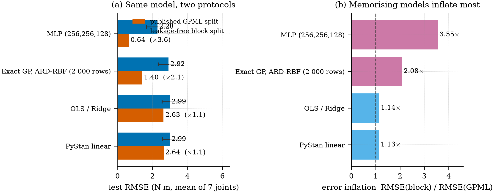

:::{.callout-tip}
## 一页摘要 · TL;DR

GPML 发布的 `sarcos_inv_test.mat`「测试集」里有 **99.93 %**（4 449 行中的 4 446 行）**原样出现在训练文件里**，
而且这份记录是**按时间排列**的。于是这个仓库里的每个模型都被打分两次：
发布版划分，以及一个无泄露的**连续分块**留出（4 折，两侧各留 100 行空隙）。

修好划分之后，**模型排序活了下来，误差尺度没有**——而且偏移量是**按模型**变化的：
MLP 0.64 → 2.28 N·m（×3.6）、精确 GP 1.40 → 2.92（×2.1）、线性 / Bayesian ridge 2.63 → 2.99（×1.13）。
**容量买到的东西，远没有发布版划分显示的那么多。**

完整站点：<https://math4mad.github.io/SARCOS-ML-with-Agents/> ｜
仓库：<https://github.com/math4mad/SARCOS-ML-with-Agents>
:::

## 问题设定 · The problem

[SARCOS](https://gaussianprocess.org/gpml/data/)（Rasmussen & Williams 的 GPML 数据页，
数据由 Stefan Schaal 一组人的 LWPR 工作产生 [@rasmussen2006gpml; @gpmlsarcos]）是一个
7 自由度拟人机械臂的**逆动力学**问题：

| | |
| --- | --- |
| 输入 | $21 = 7$ 关节位置 $q$ + $7$ 速度 $\dot q$ + $7$ 加速度 $\ddot q$ |
| 输出 | $7$ 个关节扭矩（N·m），`.mat` 的第 22–28 列 |
| 发布版规模 | 训练 44 484 行 / 测试 4 449 行 |
| GPML 惯例 | 只用第 22 列（第一个扭矩）报告结果 |
| 本仓库报告 | 7 个扭矩的**平均**测试 RMSE（N·m），并附 `torque1` 以便与书对齐 |

输入输出只用**训练集统计量**做 z-score，预测值还原后再打分。

## 一次可执行的审计 · An executable audit

```bash
python -m sarcos.data audit
```

逐行哈希的结果：4 446 / 4 449 测试行与某一行训练数据**字节相同**；
相邻行的标准化距离中位数是 $0.48$，随机行对是 $5.99$——记录是时间有序的。
这条检查写在 `tests/test_data.py` 里被断言，所以这个结论**不会悄悄腐烂**。

由此得到无泄露协议 `block`：把整条记录切成 4 段连续块，留出其中一段，
两侧各丢 100 行，保证没有时间相邻的行漏进训练集。所有模型用同样的 4 折，跨模型比较才成立。

{#fig-sarcos-protocol}

## 三条模型线 · Three model tracks

**scikit-learn 线性基线**（`linear_sklearn.py`）：`constant`、OLS、`RidgeCV`、逐关节 `LassoCV` / `ElasticNetCV`。
线性拟合顺手做了一次物理体检——最强的系数落在**加速度**项上（`torque1` 的 `acc1 ≈ 1.17`，标准化单位），
这正是逆动力学该有的样子：扭矩由惯性乘角加速度主导。

**scikit-learn MLP**（`nn_sklearn.py`）：`MLPRegressor(relu, adam)` 做结构扫描，10 % 训练行早停。
发布版划分上它比 ridge 好 4 倍（0.64 vs 2.63）；分块留出上它仍是最强的（2.28 ± 0.63），
但对线性模型的优势从 ×4.1 掉到 ×1.3。而且**容量不解决问题**：(32,32) → 2.42，(256,256,128) → 2.28，
在折间噪声里是平的。

**GPyTorch 精确 GP + ARD**（`gp_gpytorch.py`）：逐关节独立 GP，$y_j = c_j + f_j$，
$f_j \sim \mathcal N(0, s_j^2 k_{\text{ARD-RBF}})$，MAP 拟合（Adam 直接优化精确边缘似然），
预测用 `fast_pred_var`。44 484 行的核矩阵是 $44\,484^2$ 个 double，精确 GP 只能吃子样本，
于是「误差 vs 数据量」本身成了主角：

| 训练行数 | 250 | 500 | 1 000 | 2 000 |
| --- | ---: | ---: | ---: | ---: |
| `torque1` RMSE（GPML 划分） | 8.04 | 4.71 | 5.11 | 3.98 |
| `torque1` RMSE（分块留出） | 8.33 | 9.14 | 8.14 | 8.82 |

发布版划分上「更多数据 = 更好模型」，诚实划分上曲线是平的：**精确 GP 在这里是数据饥饿，而不是核选错**，
下一步是 `SVGP`。ARD 长度尺度（`torque1`，越短越重要）：
`acc1=1.70`、`acc4=2.76`、`pos5=3.15`、`acc3=3.74`、`pos1=4.39`——又是加速度优先。

**PyStan 贝叶斯线性回归**（`bayes_pystan.py` + `models/sarcos_linear.stan`）：
$\alpha\sim\mathcal N(0,5)$、$\beta\sim\mathcal N(0,1)$（标准化输入上，即 ridge 先验的贝叶斯版）、
$\sigma\sim t_4^+$，NUTS 4 链。后验均值的误差与 OLS 在噪声内相同（似然本来就一样），
多出来的是可信区间与诚实的预测分布。

## 不确定度才是交付物 · Uncertainty is the deliverable

| 模型 | 名义 95 % 覆盖（GPML 划分） | 真实段偏移下的覆盖（分块） |
| --- | --- | --- |
| 精确 GP（ARD-RBF） | 0.978 – 0.985（宽得没必要） | 0.80 – 0.97，均值 ≈ 0.91 |
| PyStan 线性 | 0.94 | 0.87 |
| OLS / Ridge / MLP | 没有区间 | 没有区间 |

被污染的划分上，GP 的区间「好得离谱」——它见过这些点；一旦换成没见过的运动片段，覆盖就掉下来。
线性与神经网络基线**根本没有预测区间**，这才是这里选 GP / Stan 的理由，而不是 RMSE。

## 只引用一个数字的话 · If you quote one number

* 引**分块留出**的 RMSE：线性 2.99、MLP 2.28、GP 2.92 N·m，并说明协议。
* 发布版 GPML 划分的数字有效但偏乐观（局部模型被压低 2–4 倍）；`kNN-20` 在那里报 0.45 N·m，
  因为它在读答案。
* 全部可复现：`bash scripts/run_all.sh`（约 50 分钟，纯 CPU）。

## 仓库是怎么长出来的 · How this repo was built

数据管道、三条模型线、划分审计、协议测试、说明页与 CI **全部由 Agent 完成**
（qwen3.8-flash，在 [Pi](https://pi.dev) 编码环境里），人类的角色是：给出问题、验收结论、
把「哪个数字可以当标题」这件事定下来。

```text
SARCOS-ML-with-Agents/
├── src/sarcos/
│   ├── data.py            # 下载 + 逐行哈希审计（python -m sarcos.data audit）
│   ├── linear_sklearn.py  # constant / OLS / RidgeCV / LassoCV / ElasticNetCV
│   ├── nn_sklearn.py      # MLPRegressor 结构扫描 + 早停
│   ├── gp_gpytorch.py     # 逐关节精确 GP，ARD-RBF，MAP + 数据量扫描
│   ├── bayes_pystan.py    # Stan NUTS（PyMC 作为 --engine 备选）
│   └── summary_table.py   # artifacts/metrics/*.json -> summary.csv / summary.md
├── models/sarcos_linear.stan
├── tests/test_data.py     # 泄露与协议断言：结论不会悄悄腐烂
├── scripts/run_all.sh     # 一条命令复现全部数字
└── .github/workflows/quarto-gh-pages.yml
```

## 局限与下一步 · Limitations

* **精确 GP 不上规模**：结果用的是 ≤ 4 k 行子样本。下一步 `SVGP`（自然梯度 / 诱导点选择），然后是全量 44 k 行。
* **每个输出一个 GP** 忽略了 7 个扭矩之间的强相关：ICM / LMC 多输出核是自然的扩展。
* **分块留出仍然只有一条轨迹**：更严格的协议是按动作段划分，但原始日志里没有我们拿不到的分段边界。
* **PyStan 在 Python 3.14 上的多链采样**仍需 `cores=` 调参；PyMC 作为同一模型的后备引擎已就位。

## 相关页面 · See also

* [下一步：在一族函数空间里搜索「谁生成了数据」](sarcos-space-search.qmd) —— 这个仓库之后的第一次追问。
* [代码片段：在候选函数空间中搜索「谁生成了数据」](../snippets/function-space-search.qmd) —— 那次追问的最小可运行验证。

## 参考文献 · References

:::{#refs}
:::
