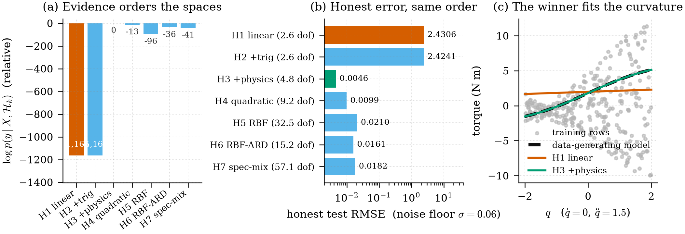

:::{.callout-note appearance="minimal"}
## 这一段对话从哪来 · Provenance

想法来自
[SARCOS 之后的第一次追问](../repos/sarcos-space-search.qmd)：
不要预先承诺假设空间，而是准备一族候选空间 $\mathcal{H}_1,\dots,\mathcal{H}_K$，
让数据去说哪一个最接近生成机制。本页把那句话变成一个能跑的文件：
[`scripts/space_search_demo.py`](https://github.com/math4mad/talk-with-agents/blob/main/scripts/space_search_demo.py)
（`numpy` + `scipy`，无需 GPU）。页面里的每个数字都来自
`output/space_search_results.csv`，由同一条命令生成：

```bash
python3 scripts/space_search_demo.py
```
:::

## 实验设定 · Setup

数据是一个「玩具逆动力学」：输入 $x=(q,\dot q,\ddot q)$ 均匀采样，
真值故意选成**物理先验里最常见的三项**——惯性、科里奥利式交叉项、重力：

$$
f(x) = \underbrace{1.2\,\ddot q}_{\text{inertia}}
     + \underbrace{0.9\,q\,\ddot q}_{\text{Coriolis-like}}
     + \underbrace{0.7\,\sin q}_{\text{gravity}}
     + \underbrace{0.25\,\dot q}_{\text{damping}},
\qquad y = f(x) + \varepsilon,\ \ \varepsilon\sim\mathcal N(0,0.06^2)
$$

$320$ 行训练、$2000$ 行**重新采样**的测试（不是同一轨迹的切分，因此没有
[SARCOS 那种泄露问题](../repos/sarcos-ml-with-agents.qmd)）。

七个候选空间，前四个是显式基（$\phi$ 给定后核就是 $k(x,x')=\phi(x)^\top\mathrm{diag}(\theta)\phi(x')$），
后三个是「无限维」的核：

| 空间 | 基 / 核 | 物理读法 |
| --- | --- | --- |
| $\mathcal{H}_1$ linear | $1,q,\dot q,\ddot q$ | 纯惯性 + 阻尼 |
| $\mathcal{H}_2$ +trig | $\mathcal{H}_1\cup\{\sin q,\cos q\}$ | 加上重力的周期成分 |
| $\mathcal{H}_3$ +physics | $\mathcal{H}_2\cup\{q\ddot q,\,q\dot q,\,\dot q\ddot q\}$ | **包含真值**的最小空间 |
| $\mathcal{H}_4$ quadratic | $\mathcal{H}_2\cup$ 全部二阶单项式 | 不挑物理，全都要 |
| $\mathcal{H}_5$ RBF | 各向同性高斯核 | 光滑、非参数 |
| $\mathcal{H}_6$ RBF-ARD | 每个输入一个长度尺度 | 各向异性光滑 |
| $\mathcal{H}_7$ spec-mix | $Q=2$ 谱混合核 [@wilson2013sm] | 自动找频率结构 |

每个空间各自最大化 log 边际似然（多起点 L-BFGS-B），然后三把尺子一起量：
$\log p(y\mid X,\mathcal{H}_k)$、闭式 GP 留一误差、以及诚实测试集 RMSE；
另记一个有效自由度 $\operatorname{tr}(K_y^{-1}K)$。

## 结果 · Results

{#fig-space-search}

| 空间 | $\log p(y\mid X,\mathcal H_k)$ | LOO RMSE | 测试 RMSE | 有效自由度 |
| --- | ---: | ---: | ---: | ---: |
| $\mathcal{H}_1$ linear | −738.42 | 2.4151 | 2.4306 | 2.6 |
| $\mathcal{H}_2$ +trig | −738.04 | 2.4103 | 2.4241 | 2.6 |
| **$\mathcal{H}_3$ +physics** | **+426.38** | **0.0597** | **0.0046** | **4.8** |
| $\mathcal{H}_4$ quadratic | +413.34 | 0.0597 | 0.0099 | 9.2 |
| $\mathcal{H}_5$ RBF | +330.07 | 0.0626 | 0.0210 | 32.5 |
| $\mathcal{H}_6$ RBF-ARD | +390.19 | 0.0601 | 0.0161 | 15.2 |
| $\mathcal{H}_7$ spec-mix | +385.23 | 0.0607 | 0.0182 | 57.1 |

三件事值得注意：

1. **证据排序 = 诚实误差排序。** 边际似然选出的 $\mathcal{H}_3$ 同时也是测试误差最低、
   自由度最小的空间——它没有「奖励复杂模型」，恰恰相反：$\mathcal{H}_4$ 多出的 4.4 个自由度
   换来了 2 倍误差，于是被奥卡姆因子扣了 13 个 nat。
2. **缺项不是靠数据能补回来的。** $\mathcal{H}_1,\mathcal{H}_2$ 的测试误差停在 $2.4$，
   与噪声水平 $0.06$ 差了 40 倍：没有 $q\ddot q$ 这个基函数，再多数据也只能拟合出「平均意义下的直线」。
3. **LOO 有噪声地板。** 闭式 LOO 是**预测含噪观测**的误差，所以它停在 $\sigma=0.06$ 附近；
   而测试 RMSE 比的是均值函数与真值，能低到 $0.0046$。两者都单调，但别把它们当成同一个量。

## 代码骨架 · Code

核心只有三个函数：核、负 log 边际似然、以及由 $K_y^{-1}$ 直接给出的闭式 LOO。

```python
def gram(kind, a, b, theta, space):
    if kind == "basis":                      # 显式基 + 每个基一个尺度（特征级 ARD）
        phi = SPACES[space][1](a) * theta
        psi = SPACES[space][1](b) * theta
        return phi @ psi.T
    tau = a[:, None, :] - b[None, :, :]
    if kind == "rbf":                        # 一个共享长度尺度
        return theta[1] ** 2 * np.exp(-0.5 * ((tau / theta[0]) ** 2).sum(-1))
    if kind == "ard":                        # 每个输入一个长度尺度
        return theta[-1] ** 2 * np.exp(-0.5 * ((tau / theta[:-1]) ** 2).sum(-1))
    if kind == "sm":                         # 谱混合核，Q = 2  [@wilson2013sm]
        w, mu, v = theta[:2], theta[2:8].reshape(2, 3), theta[8:14].reshape(2, 3)
        k = np.zeros(tau.shape[:2])
        for j in range(2):
            quad = (tau ** 2) @ v[j]
            k += w[j] ** 2 * np.exp(-2 * np.pi ** 2 * quad) * np.cos(2 * np.pi * (tau @ mu[j]))
        return k


def neg_logml(params, X, y, kind, space):
    theta, noise = np.exp(params[:-1]), np.exp(params[-1])
    K = gram(kind, X, X, theta, space) + (noise ** 2 + 1e-8) * np.eye(len(X))
    L = np.linalg.cholesky(K)
    alpha = np.linalg.solve(L.T, np.linalg.solve(L, y))
    return 0.5 * y @ alpha + np.log(np.diag(L)).sum() + 0.5 * len(y) * np.log(2 * np.pi)


def loo_rmse(X, y, kind, space, theta, noise):
    """闭式 GP 留一：e_i = [K_inv y]_i / [K_inv]_ii。"""
    K_y = gram(kind, X, X, theta, space) + (noise ** 2 + 1e-9) * np.eye(len(X))
    K_inv = np.linalg.inv(K_y)
    return np.sqrt(np.mean(((K_inv @ y) / np.diag(K_inv)) ** 2))
```

:::{.callout-important}
## 已知边界 · What this does not show

* 真值 $\mathcal{H}_3$ **被写进了候选表**，所以这是一个「识别」实验，不是「发现」实验。
  真正的难题（把基函数本身也参数化、在超空间里搜索）见
  [泛函空间 → 奇异值谱](../../talking/mathematics/functional-spaces-to-singular-values.qmd) 第 7–10 问。
* 输入是 3 维、样本 320：精确 GP 的 $O(n^3)$ 还无所谓，SARCOS 的 44 484 行就必须换 SVGP。
* 谱混合核只用了 $Q=2$ 且没有做频率初始化，$\mathcal{H}_7$ 的 57 个有效自由度里有一部分是「没学好」而不是「结构需要」。
:::

## 参考文献 · References

:::{#refs}
:::
