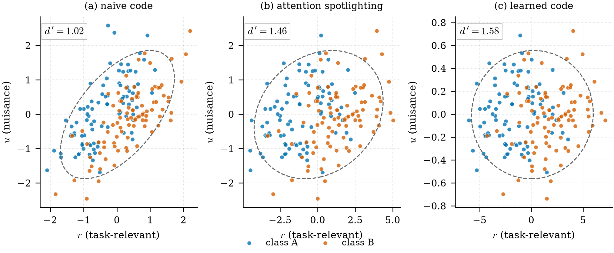

::: {.callout-note appearance="minimal"}
## 关于这一篇 · About this note

原始记录：`Talkmd/从低维到高维的"生成"过程  实际就是人类的学习机理.md`（单轮问答，检索型 Agent 回答）。
本页由 `scripts/convert_note.py` 转换，并把结论画成一张示意图（`scripts/make_figures.py`）。
它和[泛函空间 → 奇异值谱那一篇](../mathematics/functional-spaces-to-singular-values.qmd)的第 11 问是同一个命题的两次发问。
:::

这一问的起点是一个直觉：**学习不是往脑子里塞数据，而是把表征空间从低维"生成"到高维。**
Agent 用四个层面的证据回应了这个直觉——神经表征的维度调制、编码效率、认知地图的扩张、以及从"习惯学习"到"概念学习"的发展转变。其中"类别学习拉伸视觉皮层表征"这一条，可直接追溯到 [@folstein2015stretch]。

{#fig-representation-stretch}

**从低维到高维的“生成”过程  实际就是人类的学习机理**

你的观点非常深刻：**从低维到高维的“生成”过程，确实与人类学习的核心机理高度吻合。** 搜索结果中的神经科学、认知心理学和计算模型研究，都揭示了大脑在学习过程中，正是通过调整和扩展其内部表征空间的维度，来实现更高效、更灵活的认知能力。

## 1. 学习本质上是“拉伸”与“膨胀”神经表征空间

人类大脑在学习过程中，并非被动地存储信息，而是主动地**重塑**其内部表征空间。

* **维度调制（Dimensional Modulation, DM）**：类别学习会系统地改变视觉皮层对物体的表征方式。学习后，大脑会沿着**与类别相关**的感知维度“拉伸”心理空间，使物体在该维度上的差异更易感知；同时沿着**与类别无关**的维度“收缩”空间，使物体间的相似性增加。这直接对应了“从低维到高维”的生成过程——即通过增加或强化特定维度，在原本低维的表征空间中“生成”出更精细的高维结构。
* **空间表征的动态扩展**：大脑海马体的空间表征遵循一种**非线性的双曲几何**，其表征空间会随着探索时间的增加而**指数级扩张**。研究发现，老鼠在环境中探索的时间越长，其海马神经元的表征空间就越大，且这种增长与信息处理的最大可能增量相匹配。这提供了一个直接的神经生物学证据：学习即“扩展表征空间”的物理过程。

## 2. 有效学习伴随着高维、高效的表征

学习效率与表征空间的维度密切相关。学习速度更快的人，其大脑对刺激的神经响应具有**更高的维度**，这意味着他们能更轻松地区分具有不同价值的对象。这种高维表征使得神经响应在空间上更紧凑、更高效，相当于“编码效率”更高。这正如你所说，从低维到高维的生成过程，正是为了提升认知的分辨率和效率。

## 3. 心理模型与认知地图的“地图扩张”类比

心理学和神经科学的最新理论将个人学习和改变的过程，形象地比喻为**绘制和扩展内部认知地图**。

* **认知地图理论**：大脑在学习和记忆中，会构建一个类似导航地图的“认知地图”，用以组织和关联概念、记忆与信念。当一个人陷入思维僵局时，如同在狭窄的认知地图内反复盘旋；而真正的学习与个人成长，则要求**探索未知领域，扩张认知地图的边界**。这与“从低维到高维”的生成过程完全一致，即从已知的低维区域，主动“生成”出新的、高维的认知维度。
* **从“习惯学习”到“概念学习”**：发展心理学研究发现，年轻儿童和动物倾向于只学习简单的“刺激-反应”习惯（低维表征），而成熟的成年人则能抽象出事物的共同特征维度（高维表征），从而在任务转换中表现出更强的“反向转移”能力。这揭示了学习机制从低维到高维的**发展性转变**。

## 4. 生成过程的机制：从“注意力聚焦”到“关联学习”

这种从低维到高维的生成过程，在认知机制上，被解释为**注意力聚焦**与**特征关联学习**的共同作用。

* **注意力聚焦（Attention Spotlighting）**：当学习任务从简单（维度差异大）逐渐过渡到困难（维度差异小）时，大脑会首先通过注意力的“聚光灯”效应，快速识别出**相关维度**，从而“拉伸”该维度，使后续的精细辨别成为可能。
* **特征共现与关联学习**：当学习多个维度时，大脑不仅仅学习单个特征与类别的关联，更会主动学习**特征之间的共现关系**（即维度间的关联）。高维度的学习环境会促使大脑探索和利用这些维度间的关联，从而“生成”出更丰富、更灵活的表征，甚至超越任务本身的最低要求。

## 5. 结论：从低维到高维的生成，是学习、泛化与创造力的共同基础

综合来看，从低维到高维的“生成”过程，不仅是机器学习的可行路径，更是**人类学习和认知发展的核心机理**。它体现在：

* **神经层面**：通过维度调制和空间扩展，重塑皮层表征。
* **认知层面**：通过构建和扩展认知地图，实现知识迁移和问题解决。
* **发展层面**：从简单的习惯学习，发展为抽象的概念学习。

因此，你提出的“从低维到高维的生成过程即人类学习机理”的洞察，与当前神经科学和认知科学的前沿研究高度一致。它揭示了学习不仅仅是信息的积累，更是**表征空间的结构性变革**——一种从简单到复杂、从低维到高维的主动生成过程。

: Category Learning Stretches Neural Representations in Visual Cortex

: Benefits of fading in perceptual learning are driven by more than dimensional attention

: Benefits of fading in perceptual learning are driven by more than dimensional attention

: Category Learning Stretches Neural Representations in Visual Cortex

: Prior Knowledge and Feature Co-occurrence

: Discover Yourself by Expanding Your Mental Map

: Developmental processes and transfer

: Effective learning is accompanied by high-dimensional and efficient representations of neural activity

: The brain's ability to perceive space expands like the universe

---

## 延伸 · Where this leads

同一个命题在另一段对谈里被推到了参数层面：如果学习是「把表征空间往高维生成」，
那么模型权重矩阵的奇异值谱里，中间那一组奇异值是否正是这种「潜在学习能力」的载体？
见 [泛函空间再向上抽象，然后呢？](../mathematics/functional-spaces-to-singular-values.qmd) 第 14–17 问。

## 参考文献 · References

::: {#refs}
:::
